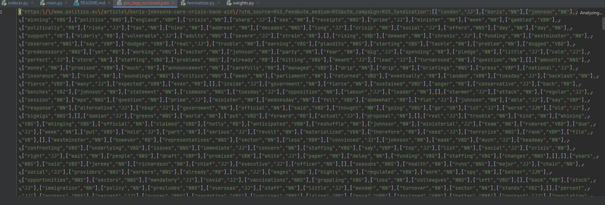

# Results

### Τα αποτελέσματα από όλα τα υποσυστήματα του Scraper-Tokenizer μπορούν να βρεθούν εδώ

#

#### Raw Scraping results
| File    | Description |
| ----------- | ----------- |
| [news_en.html]()| Euronews scraping results |
| [news_news.html]()| BBC scraping results |
| [news_www.eureporter.co.html]()| Eureporter scraping results |
| [news_www.politico.eu.html]()| Politico scraping results |
| [news_xml.html]() | Aljazeera scraping results|
#
#### Tokenizer Output
| File    | Description |
| ----------- | ----------- |
| [pos_tags.json](https://github.com/evedour/scraper_tintin/blob/main/Scraper/NewsScrape/Results/pos_tags.json)| Tokenized and POS tagged articles. |

#

#

#### Vector Representation and Lemmatization
| File    | Description |
| ----------- | ----------- |
| [lemmas.txt]()| Lemmas extracted in list form |
| [pos_tags_noclosed.json]() | Tokenized and POS tagged articles, closed-class categories removed|
| [thesaurus_dictionary.txtdic]() | Lemmas Dictionary |

#

#

#### Inverse Index
| File    | Description |
| ----------- | ----------- |
| [inverted_index.xml]()| The final inverted index |

